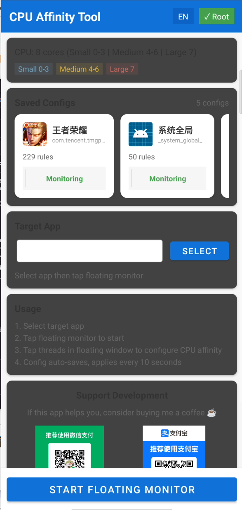
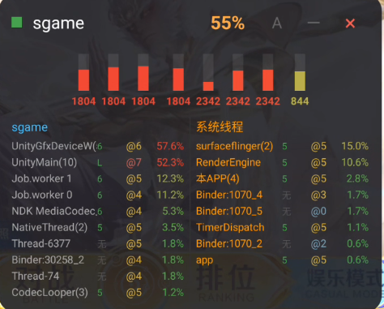
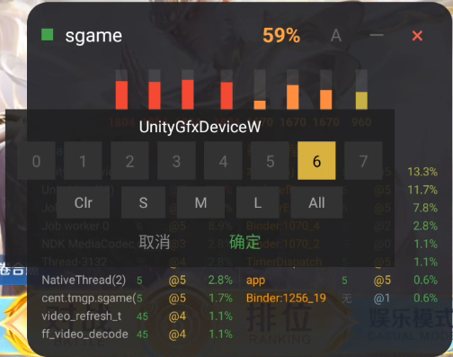

# Thread Affinity Manager

[中文文档](README_CN.md)

## Why This Tool?

Android's default kernel scheduler often makes suboptimal decisions — small cores end up doing heavy work while big cores sit idle. This "small cores working, big cores watching" problem leads to:

- **High CPU load** on efficiency cores while performance cores remain underutilized
- **Excessive heat** due to inefficient workload distribution  
- **Poor performance** as tasks don't migrate to idle high-performance cores
- **Scheduler resets** that override manual affinity settings

Thread Affinity Manager solves these issues by letting you pin specific threads to your preferred CPU cores. Using a loop-based configuration system, it continuously enforces your affinity rules, ensuring threads with the same name always run on designated cores — regardless of what the kernel scheduler decides.

---

A powerful Android application for monitoring and managing thread CPU affinity. Requires Root access.

**Optimized for ZTE, Nubia, and RedMagic devices.**

## Supported Devices

### Automatic CPU Detection
The app automatically detects your CPU configuration by reading the maximum frequency of each core, then intelligently groups cores into categories (Small/Medium/Large). This means it works with various CPU architectures:

- **Snapdragon 8 Gen2/Gen3** (1+4+3 or 1+3+4 layout)
- **Snapdragon 8 Gen1** (1+3+4 layout)
- **Snapdragon 888/870** (1+3+4 layout)
- **MediaTek Dimensity** series
- **Other ARM big.LITTLE architectures**

### Optimized For
While the app works on most rooted Android devices, the CPU boost configurations are specifically tuned for:
- **ZTE** series
- **Nubia** series  
- **RedMagic** gaming phones (RedMagic 8 Pro, 9 Pro, etc.)

The boost parameters target Nubia's kernel (e.g., `cpufreq_ctrl`, `walt` scheduler), but core affinity features work universally.

## Features

### Core Features
- **Real-time Thread Monitoring**: View all threads of target application with CPU usage
- **CPU Affinity Configuration**: Bind specific threads to designated CPU cores
- **Floating Window Monitor**: Always-on-top overlay showing CPU frequencies, loads, and thread status
- **System Thread Management**: Configure affinity for system processes (surfaceflinger, system_server)
- **Configuration Persistence**: Save and auto-apply affinity settings

### CPU Optimization
- Automatic CPU boost configuration (disable EAS, core_ctl, etc.)
- Aggressive frequency scaling parameters
- Scheduler parameter tuning to prevent affinity reset

The CPU boost commands are located in `FloatingWindowService.java` → `applyAffinityInBackground()` method. These commands are executed every 10 seconds to prevent the system from resetting the settings.

### User Interface
- Minimized/Maximized floating window modes
- Adjustable transparency (5 levels)
- Draggable window position
- Color-coded CPU core indicators (small/medium/large cores)

## Requirements

### Build Requirements
- Android Studio or Gradle CLI
- Android SDK 34+
- NDK 25.x or higher
- CMake 3.22.1+

### Runtime Requirements
- Android 8.0+ (API 26+)
- Root access (Magisk recommended)
- Overlay permission

## Build Instructions

1. Create `local.properties` with SDK/NDK paths:
```properties
sdk.dir=C\:\\Users\\YourName\\AppData\\Local\\Android\\Sdk
ndk.dir=C\:\\Users\\YourName\\AppData\\Local\\Android\\Sdk\\ndk\\25.2.9519653
```

2. Build via command line:
```bash
cd ThreadAffinityManager
./gradlew assembleDebug
```

3. APK output: `app/build/outputs/apk/debug/app-debug.apk`

## Usage

### Basic Usage
1. Install APK on rooted device
2. Grant overlay permission when prompted
3. Select target application from the app list
4. Tap "Start Floating Monitor" to launch overlay
5. Click on any thread in the floating window to configure its CPU affinity
6. Configuration is auto-saved and applied every 10 seconds

### Screenshots

#### Main Interface

| English | 中文 |
|:-------:|:----:|
|  |  |

#### Floating Monitor

| Floating Monitor | Thread Affinity Selection |
|:----------------:|:-------------------------:|
|  |  |

- **Floating Monitor**: Shows CPU frequencies, loads, and thread list with CPU usage
- **Thread Affinity**: Click any thread to select which CPU cores it should run on

### Quick Start via ADB
```bash
# Start monitoring for specific package
am start -a com.threadaffinity.QUICK_START -e package com.example.app
```

### Floating Window Controls
- **Tap header**: Drag to move window
- **α button**: Cycle through transparency levels
- **− button**: Minimize to compact view
- **× button**: Close and exit app

### CPU Core Layout (Auto-Detected)

The app automatically detects your CPU layout. Example for Snapdragon 8 Gen2:

| Cores | Type | Mask |
|-------|------|------|
| 0-2 | Small (Efficiency) | 0x07 |
| 3-6 | Medium (Performance) | 0x78 |
| 7 | Large (Prime) | 0x80 |

For other CPUs, the app reads `/sys/devices/system/cpu/cpuX/cpufreq/cpuinfo_max_freq` and groups cores by their maximum frequency automatically.

## Configuration Format

Configurations are stored as JSON files in the app's internal storage.

### Example: App Configuration
```json
{
  "packageName": "com.example.game",
  "appName": "Example Game",
  "timestamp": 1704067200000,
  "threadAffinities": {
    "GameThread": 64,
    "RenderThread": 128,
    "AudioTrack": 56
  }
}
```

### Example: System Global Configuration
```json
{
  "packageName": "_system_global_",
  "appName": "System Global",
  "threadAffinities": {
    "surfaceflinger": 224,
    "RenderEngine": 224,
    "InputDispatcher": 48
  }
}
```

### Affinity Mask Values
| Value | Binary | Cores |
|-------|--------|-------|
| 7 (0x07) | 00000111 | 0,1,2 (Small) |
| 56 (0x38) | 00111000 | 3,4,5 (Medium) |
| 120 (0x78) | 01111000 | 3,4,5,6 (Medium) |
| 64 (0x40) | 01000000 | 6 |
| 128 (0x80) | 10000000 | 7 (Large) |
| 192 (0xC0) | 11000000 | 6,7 (Large) |
| 224 (0xE0) | 11100000 | 5,6,7 |
| 255 (0xFF) | 11111111 | All cores |

## Architecture

```
ThreadAffinityManager/
├── app/src/main/
│   ├── java/.../
│   │   ├── MainActivity.java       # Main UI
│   │   ├── NativeHelper.java       # JNI interface
│   │   ├── QuickStartActivity.java # ADB quick start
│   │   ├── service/
│   │   │   └── FloatingWindowService.java  # Floating window
│   │   ├── model/
│   │   │   ├── AppConfig.java      # Configuration model
│   │   │   └── ThreadInfo.java     # Thread data model
│   │   └── util/
│   │       ├── ConfigManager.java  # Config persistence
│   │       ├── RootHelper.java     # Root command execution
│   │       └── ProcessHelper.java  # Process utilities
│   ├── cpp/
│   │   └── native-lib.cpp          # Native implementation
│   └── res/layout/
│       └── layout_floating_window.xml
└── configs/                         # Example configurations
```

## Troubleshooting

### Affinity Not Applied
- Check if root access is granted
- Some ROMs may override affinity settings
- Try disabling system performance managers

### High CPU Usage
- Reduce monitoring frequency in settings
- Minimize floating window when not needed

### App Crashes
- Check logcat for errors:
```bash
adb logcat -s FloatingWindowService:* NativeHelper:* RootHelper:*
```

## Donate

If this project helps you, consider supporting the development:

| WeChat | Alipay |
|:------:|:------:|
|  |  |

Your support is greatly appreciated! ☕

## License

MIT License

## Acknowledgments

- Uses JNI for native thread affinity operations
- Inspired by various CPU tuning tools in the Android community
